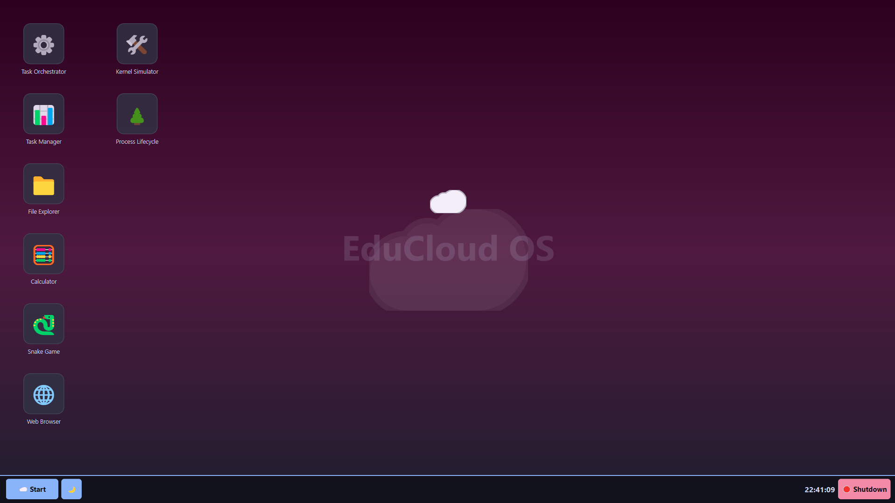
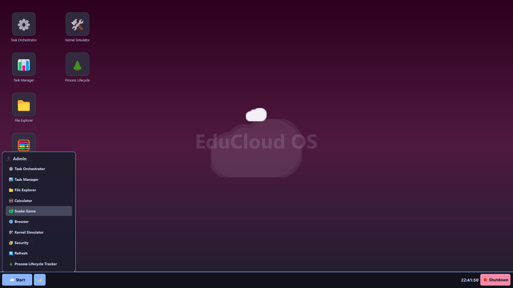
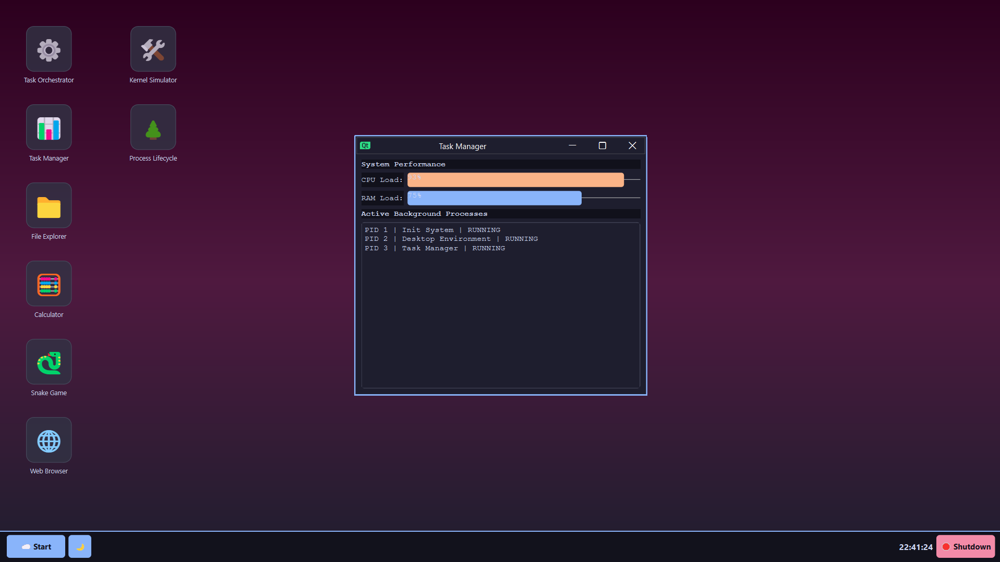
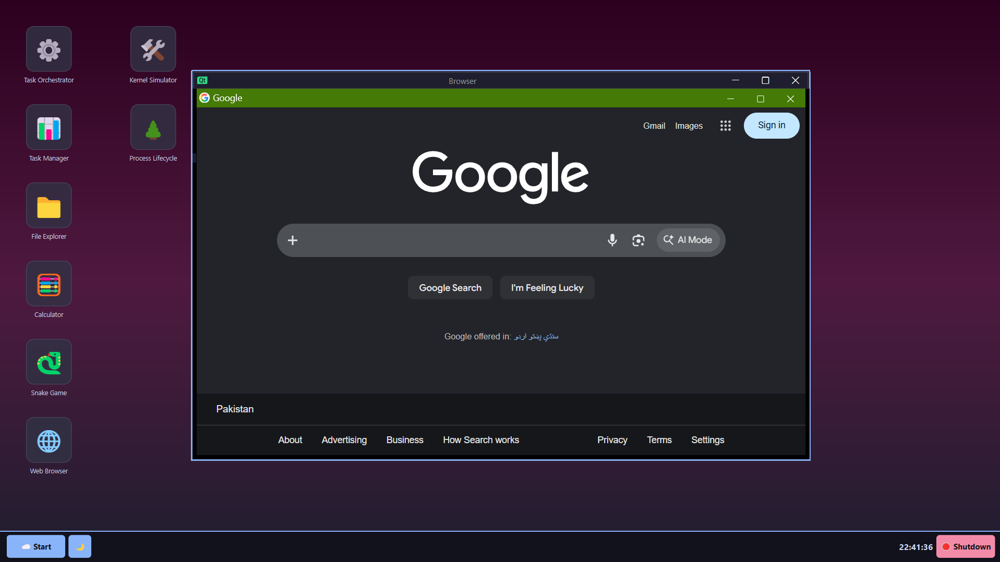
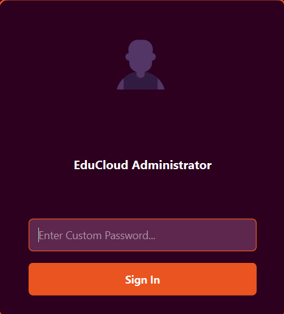
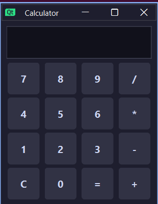

<div align="center">

# ☁️ EduCloud OS

### An Interactive Operating System Simulation & Educational Desktop Environment

<p>
  <b>Learn Operating Systems by actually interacting with them.</b>
</p>

<p>
  EduCloud OS transforms core Operating Systems concepts such as
  CPU scheduling, process states, resource management, task orchestration,
  virtual file systems, and system monitoring into an interactive desktop environment.
</p>

<br>


</div>

---

## 📖 Table of Contents

- [About EduCloud OS](#-about-educloud-os)
- [Project Motivation](#-project-motivation)
- [Project Goals](#-project-goals)
- [What Makes EduCloud OS Different?](#-what-makes-educloud-os-different)
- [Application Showcase](#-application-showcase)
- [Core Features](#-core-features)
- [Operating Systems Concepts Demonstrated](#-operating-systems-concepts-demonstrated)
- [System Architecture](#-system-architecture)
- [Project Architecture](#-project-architecture)
- [Project Structure](#-project-structure)
- [Technology Stack](#-technology-stack)
- [Build Requirements](#-build-requirements)
- [Build & Run](#-build--run)
- [How the System Works](#-how-the-system-works)
- [Educational Value](#-educational-value)
- [Testing](#-testing)
- [Future Development](#-future-development)
- [Teaching Applications](#-teaching-applications)
- [Project Scope](#-project-scope)
- [Team](#-team)
- [Academic Context](#-academic-context)
- [License](#-license)

---

# ☁️ About EduCloud OS

**EduCloud OS** is an interactive desktop environment and Operating Systems simulation platform developed using **C++17, Qt, and CMake**.

The project was designed to bridge the gap between **theoretical Operating Systems concepts** and **practical software behavior**.

Instead of studying concepts such as CPU scheduling, process states, resource allocation, virtual file systems, and system monitoring only through diagrams and textbook examples, EduCloud OS provides an environment where these concepts can be explored through an interactive graphical interface.

> **EduCloud OS is not intended to replace or emulate a production operating system kernel. It is an educational simulation environment designed to demonstrate and visualize Operating Systems concepts.**

---

# 🎯 Project Motivation

Operating Systems is a highly conceptual subject.

Students commonly study:

- Processes
- Threads
- CPU Scheduling
- Process States
- Memory Management
- File Systems
- Resource Allocation
- Synchronization
- System Monitoring

However, understanding how these concepts interact inside an actual computing environment can be difficult.

EduCloud OS addresses this problem by providing a **visual and interactive learning environment**.

The overall idea is:

```text
                THEORY
                  │
                  ▼
        ┌───────────────────┐
        │ Operating Systems │
        │     Concepts      │
        └─────────┬─────────┘
                  │
                  ▼
        ┌───────────────────┐
        │   EduCloud OS     │
        │ Interactive Labs  │
        └─────────┬─────────┘
                  │
                  ▼
              PRACTICE
                  │
                  ▼
           BETTER UNDERSTANDING
```

---

# 🚀 Project Goals

EduCloud OS was developed with several major objectives.

### 🎓 Educational
Turn abstract OS concepts into visual, interactive demonstrations.

### 🧠 Conceptual
Allow students to understand how processes, tasks, scheduling, resources, and system applications interact.

### 🖥️ Practical
Provide a desktop environment containing multiple applications instead of isolated demonstrations.

### 🧩 Modular
Keep applications separated into independent modules so the system can be expanded easily.

### 🔍 Observable
Make internal system behavior visible through dashboards, monitors, task managers, and analyzers.

### 🛠️ Extensible
Provide a foundation that can be extended with additional Operating Systems simulations and educational modules.

---

# ⭐ What Makes EduCloud OS Different?

A conventional OS project might implement a single concept such as CPU scheduling or process management.

EduCloud OS instead combines multiple concepts into one environment:

```text
                    ☁️ EDUCloud OS
                          │
        ┌─────────────────┼─────────────────┐
        │                 │                 │
        ▼                 ▼                 ▼
    Processes         Scheduling       Resources
        │                 │                 │
        ▼                 ▼                 ▼
   Task Manager      Orchestrator      Monitoring
        │                 │                 │
        └─────────────────┼─────────────────┘
                          │
                          ▼
                   Desktop Environment
                          │
        ┌─────────────────┼─────────────────┐
        ▼                 ▼                 ▼
      Browser          Security          Utilities
        │                 │                 │
        ▼                 ▼                 ▼
    Virtual FS       System Tools       Games
```

The result is closer to a **miniature educational computing environment** than a single-feature simulator.

---

# 🖥️ Application Showcase

## 🏠 Main Dashboard

The Dashboard acts as the central entry point to EduCloud OS.



---

## 🖥️ Desktop Environment

EduCloud OS provides a complete desktop-style environment with an application launcher, taskbar, windows, system controls, and a structured workspace.



---

# ⚙️ Core Features

## 1. 🖥️ Desktop Shell & User Environment

The desktop shell provides the foundation of the EduCloud OS experience.

### Key Features

- Multi-window desktop environment
- Multiple application instances
- Application launcher
- Persistent taskbar
- System clock
- Context menu
- Window management
- Dark modern interface
- Central workspace
- Application lifecycle management

### MDI Window Architecture

The application uses Qt's `QMdiArea` architecture to support multiple child applications inside the main desktop.

```text
┌─────────────────────────────────────────────────┐
│                 EDUCloud OS                     │
├─────────────────────────────────────────────────┤
│ Start │ Apps │                             15:42│
├─────────────────────────────────────────────────┤
│                                                 │
│    ┌───────────────────┐  ┌─────────────────┐   │
│    │   Task Manager    │  │   Calculator    │   │
│    │                   │  │                 │   │
│    │                   │  │                 │   │
│    └───────────────────┘  └─────────────────┘   │
│                                                 │
│                 Desktop Workspace               │
└─────────────────────────────────────────────────┘
```

---

## 2. ⚙️ Task Orchestrator — CPU Scheduling

The **Task Orchestrator** is one of the primary Operating Systems components.

It demonstrates CPU scheduling algorithms through an interactive environment.


### Supported Scheduling Concepts

- First Come First Serve (FCFS)
- Shortest Job First (SJF)
- Priority Scheduling
- Task arrival order
- Burst time
- Execution priority
- Process state progression

### Task Lifecycle

```text
                 CREATE
                    │
                    ▼
                  READY
                    │
                    ▼
                SCHEDULED
                    │
                    ▼
                 RUNNING
                    │
             ┌──────┴──────┐
             ▼             ▼
          BLOCKED       TERMINATED
             │
             └──────► READY
```

---

## 3. 📊 Task Manager — Process Monitoring

The Task Manager provides an interactive system monitoring interface.



### Features

- Running application tracking
- Task/process identification
- Resource information
- Process lifecycle monitoring
- Application termination
- Window lifecycle management
- Runtime diagnostics

The Task Manager demonstrates how operating systems maintain information about active workloads.

---

## 4. 🧠 Kernel Resource Monitor

The Kernel Resource Monitor provides a centralized view of simulated system resources.


### Conceptual Areas

- Resource utilization
- Running workloads
- System activity
- Resource allocation
- Runtime state

This module provides an educational abstraction of the type of information that a real operating system exposes to system monitoring utilities.

---

## 5. 🔄 Process State Analyzer

The Process State Analyzer focuses specifically on process lifecycle and state transitions.


### Typical Process States

```text
             ┌─────────┐
             │  NEW    │
             └────┬────┘
                  │
                  ▼
             ┌─────────┐
             │ READY   │
             └────┬────┘
                  │
                  ▼
             ┌─────────┐
             │ RUNNING │
             └────┬────┘
                  │
          ┌───────┼────────┐
          ▼       ▼        ▼
      WAITING  READY   TERMINATED
          │
          └──────────────► READY
```

---

## 6. 📁 Virtual File System

EduCloud OS includes a sandboxed virtual file management environment.

The system models storage without directly exposing the simulated file system to destructive modifications of the host environment.

### Features

- File creation
- File saving
- File opening
- File reading
- Virtual directories
- File indexing
- In-memory data management

The implementation uses Qt containers such as:

```cpp
QMap<QString, QString>
```

to represent virtual storage structures.

---

## 7. 🌐 Virtual Browser

EduCloud OS includes a lightweight simulated browser environment.



### Features

- Address bar
- Navigation controls
- Back / Forward behavior
- Homepage
- Dynamic HTML generation
- Search simulation
- Query processing
- Page rendering

The browser was intentionally designed to work without depending on a full Chromium-based browser stack.

---

## 8. 🔐 Security Center

EduCloud OS contains a dedicated security-oriented application.



The security module provides an educational environment for demonstrating system security concepts and security-related functionality.

---

## 9. 🧮 Calculator

The integrated Calculator provides standard arithmetic functionality inside the simulated operating system.



It demonstrates how ordinary desktop utilities can coexist alongside system-level educational modules.

---

## 10. 🐍 Snake Game

EduCloud OS also contains an interactive Snake Game.


The game provides practical examples of:

- Keyboard event handling
- Timer-driven updates
- Collision detection
- Grid-based movement
- Application state
- Event-driven programming

---

# 🧠 Operating Systems Concepts Demonstrated

| Concept | Demonstrated Through |
|---|---|
| Process Management | Task Manager, Process State Analyzer |
| Process States | Process State Analyzer |
| CPU Scheduling | Task Orchestrator |
| FCFS | Task Orchestrator |
| SJF | Task Orchestrator |
| Priority Scheduling | Task Orchestrator |
| Resource Management | Kernel Resource Monitor |
| Task Management | Task Manager |
| Virtual File Systems | File Explorer |
| System Monitoring | Dashboard / Kernel Monitor |
| Application Lifecycle | Desktop Shell |
| Event-driven Programming | Qt applications |
| Memory/Data Structures | Virtual FS and application state |
| Security Concepts | Security Center |
| GUI Architecture | Qt Desktop Shell |

---

# 🏗️ System Architecture

EduCloud OS follows a modular architecture.

```text
┌──────────────────────────────────────────────────────┐
│                    EDUCloud OS                       │
├──────────────────────────────────────────────────────┤
│                 Desktop Shell                       │
│                                                      │
│   Start Menu │ Taskbar │ Windows │ Clock │ Workspace │
├──────────────────────────────────────────────────────┤
│                  Application Layer                   │
│                                                      │
│ ┌──────────┐ ┌────────────┐ ┌────────────────────┐  │
│ │ Task     │ │ Process    │ │ Kernel Resource    │  │
│ │ Manager  │ │ Analyzer   │ │ Monitor            │  │
│ └──────────┘ └────────────┘ └────────────────────┘  │
│                                                      │
│ ┌──────────┐ ┌────────────┐ ┌────────────────────┐  │
│ │ Browser  │ │ Security   │ │ Virtual File       │  │
│ │          │ │ Center     │ │ System             │  │
│ └──────────┘ └────────────┘ └────────────────────┘  │
│                                                      │
│ ┌──────────┐ ┌────────────┐                         │
│ │Calculator│ │ Snake Game │                         │
│ └──────────┘ └────────────┘                         │
├──────────────────────────────────────────────────────┤
│                   Qt Framework                       │
├──────────────────────────────────────────────────────┤
│                   C++17 Core                         │
├──────────────────────────────────────────────────────┤
│              Host Operating System                   │
└──────────────────────────────────────────────────────┘
```

---

# 🧩 Project Architecture

Each major feature is separated into its own application/module.

```text
Desktop
   │
   ├── TaskManagerApp
   ├── TaskOrchestrator
   ├── KernelResourceMonitor
   ├── ProcessStateAnalyzer
   ├── Browser
   ├── Security
   ├── Calculator
   └── SnakeGame
```

This architecture allows individual components to be:

- Modified independently
- Debugged independently
- Extended independently
- Reused for future educational modules

---

# 📁 Project Structure

A simplified structure is:

```text
EduCloudOS/
│
├── assets/
│   ├── Browser.png
│   ├── Calculator.png
│   ├── Dashboard.png
│   ├── Kernal Resource monitor.png
│   ├── Process State Analyzer.png
│   ├── Security.png
│   ├── Snake Game.png
│   ├── StartMenu.png
│   ├── Task Orchestrator.png
│   └── Taskmanager.png
│
├── core/
│   ├── desktop.cpp
│   ├── desktop.h
│   ├── taskmanagerapp.cpp
│   ├── ...
│   └── CMakeLists.txt
│
├── CMakeLists.txt
└── README.md
```

---

# 🛠️ Technology Stack

| Technology | Purpose |
|---|---|
| **C++17** | Core application development |
| **Qt 6** | GUI framework and desktop environment |
| **CMake** | Build configuration and project management |
| **MinGW / GCC** | Compilation |
| **Qt Widgets** | Desktop and application interfaces |
| **Qt Events** | Input and application interaction |
| **Qt Timers** | Periodic and real-time operations |
| **Qt Containers** | Internal data structures |
| **Git** | Version control |

---

# 💻 Supported Platforms

### Primary Development Environment

- Windows

### Target Platforms

- Windows
- Linux
- macOS

Platform-specific deployment may require the appropriate Qt runtime libraries and build configuration.

---

# 🔨 Build Requirements

To build EduCloud OS from source, install:

- Qt 6.x
- Qt Creator
- CMake 3.16+
- MinGW / GCC or another supported C++17 compiler

### Minimum C++ Standard

```text
C++17
```

### Build System

```text
CMake
```

---

# ▶️ Build & Run

## 1. Clone the Repository

```bash
git clone <repository-url>
cd EduCloudOS
```

## 2. Open the Project

Open the project using Qt Creator.

## 3. Configure the Kit

Select an appropriate Qt kit such as:

```text
Desktop Qt 6.x MinGW 64-bit
```

## 4. Configure CMake

Allow Qt Creator to configure the CMake project.

## 5. Build

Build the project using:

```text
Build → Build Project
```

## 6. Run

Launch the application from Qt Creator.

---

# 🔄 How the System Works

At a high level, the application follows this lifecycle:

```text
                   Application Start
                          │
                          ▼
                  Initialize Desktop
                          │
                          ▼
                   Load Applications
                          │
                          ▼
                  Display Dashboard
                          │
              ┌───────────┼───────────┐
              ▼           ▼           ▼
          Task Mgmt    Scheduler   Monitoring
              │           │           │
              └───────────┼───────────┘
                          ▼
                    User Interaction
                          │
                          ▼
                    Event Processing
                          │
                          ▼
                  Application Updates
```

Qt's event-driven architecture manages user input, timers, window operations, and application interactions.

---

# 🎓 Educational Value

One of the primary goals of EduCloud OS is to make the project useful beyond a single semester.

The application can serve as a practical teaching tool for future Operating Systems students.

### CPU Scheduling Laboratory

A teacher can demonstrate:

```text
FCFS
 ↓
SJF
 ↓
Priority Scheduling
 ↓
Compare Results
```

### Process Management

Students can observe:

```text
NEW
 ↓
READY
 ↓
RUNNING
 ↓
WAITING
 ↓
READY
 ↓
TERMINATED
```

### Resource Monitoring

Students can observe how tasks and applications can be represented through resource-monitoring interfaces.

### Virtual File Systems

Students can explore how file systems can be represented using data structures and application-level abstractions.

---

# 🔬 Testing

EduCloud OS was tested through functional interaction with its individual applications and desktop environment.

Testing areas include:

- Application launching
- Window management
- Task creation
- Scheduling behavior
- Process state transitions
- Virtual file operations
- Browser navigation
- Security module functionality
- Calculator operations
- Snake Game controls
- Application closing
- Desktop interaction
- UI responsiveness

---

# 🚀 Future Development

EduCloud OS provides a foundation for additional Operating Systems laboratories.

Potential future additions include:

- Round Robin scheduling visualization
- Multilevel Queue Scheduling
- Multilevel Feedback Queue
- Memory allocation simulator
- Paging simulator
- Page replacement algorithms
- Virtual memory laboratory
- Deadlock detection
- Banker's Algorithm visualization
- Mutex demonstrations
- Semaphore demonstrations
- Thread synchronization laboratory
- IPC demonstrations
- File allocation algorithms
- Disk scheduling algorithms
- Disk management simulator
- Cache simulation
- More security laboratories
- Networking simulations
- Educational quizzes
- Instructor mode
- Student experiment mode
- Built-in OS theory documentation

---

# 🧑‍🏫 Teaching Applications

A major long-term objective of EduCloud OS is to allow instructors to use the project as a practical teaching environment.

Instead of explaining:

> "This is how FCFS works."

An instructor can demonstrate it directly.

Instead of explaining:

> "A process can move between READY and RUNNING states."

Students can observe the state model.

Instead of only drawing:

```text
Process → Scheduler → CPU
```

students can interact with a visual representation.

This is the core philosophy behind EduCloud OS:

> **Don't just study the concept. Interact with it.**

---

# 📸 Complete Interface Gallery

The following screenshots demonstrate the major components of the finished environment.

## Dashboard


## Start Menu


## Task Orchestrator


## Task Manager


## Kernel Resource Monitor


## Process State Analyzer


## Virtual Browser


## Security Center


## Calculator


## Snake Game


---

# 🔐 Project Scope

EduCloud OS is a **simulation and educational environment**, not a replacement for Windows, Linux, or another production operating system.

The project operates as a desktop application running on top of the host operating system.

Its purpose is to provide:

- Concept visualization
- OS education
- Interactive simulations
- Desktop application architecture
- Practical programming experience

---

# 👥 Team

EduCloud OS was developed as a group academic project for an Operating Systems course.

Individual responsibilities and contributions can be documented separately according to team member involvement.

---

# 📚 Academic Context

| Field | Details |
|---|---|
| Project Name | EduCloud OS |
| Project Type | Operating Systems Semester Project |
| Programming Language | C++17 |
| GUI Framework | Qt 6 |
| Build System | CMake |
| Primary Platform | Windows |
| Target Platforms | Windows / Linux / macOS |

---

# 📄 License

This project is released under the **MIT License**.

See the `LICENSE` file for more information.

---

<div align="center">

# ☁️ EduCloud OS

### Learn. Simulate. Interact. Understand.

**An interactive approach to Operating Systems education.**

<br>

Made with ❤️ using C++17, Qt & CMake.

</div>
